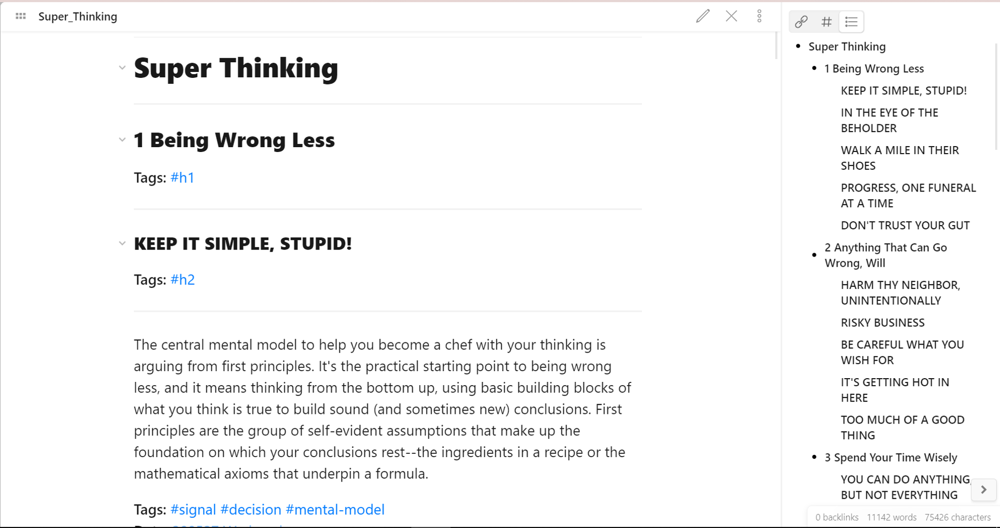
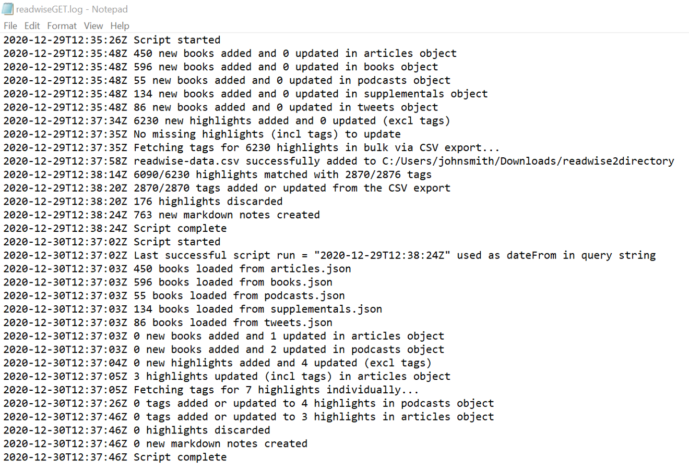

# Contributions

 

If you like this plugin, please consider donating; I really appreciate any and all support! ❤️

---

# Description

Fetch new books and highlights from Readwise and print the results as markdown files in a chosen directory (i.e. Obsidian vault)

I'm a huge fan of [Readwise](https://readwise.io/) and [Obsidian](https://obsidian.md/), and I hope this is helpful to others like me who wanted something a bit different than the basic markdown export (beta)

# Features

- Fetch all or subset of new books and highlights from Readwise (via their API https://readwise.io/api_deets)
	- Filter by custom `date from` or `last script run` date
- Group and sort highlights by book/article/podcast/tweet
- Create new markdown notes or append to existing ones in a chosen directory (i.e. Obsidian vault)
	- Filenames are formatted using [slugify](https://docs.djangoproject.com/en/3.1/ref/utils/)
	- Highlights with 'discard' tag are removed
	- Books with no highlights are ignored
- Markdown notes are formatted as: 
	- Book metadata - in YAML format
		- Title
		- Author
		- Number of highlights
		- Last updated date - formatted as "YYMMDD dddd" in wikilinks
		- Readwise URL
 	- Title - as a heading 1
 	- Highlight data
		- Text
		- Block reference ID - using the Readwise highlight ID as the unique block reference
		- Note
		- Tags - optional
		- References (e.g. original URL) 
		- Date - formatted as "YYMMDD dddd" in wikilinks
- Store book and highlight data into JSON files for easy retrieval and manipulation
- Print outputs to the console and store in a log file for troubleshooting

# Screenshots

##### Markdown note with book metadata as YAML frontmatter

##### Highlight data with Readwise highlight ID's as unique block references 

##### Markdown note with headings (h1-h5) from Readwise

##### Graph view of results

##### Log file of outputs

# Installation

- Clone this repo or download the ZIP folder and move to a chosen directory - this will serve as the `sourceDirectory` for running the scripts
	- Make sure the `readwiseCategories` folder is in the same directory as the `readwise-GET.py` script. This will store your JSON files.
- Configure the `readwiseMetadata.py` file:
	- Required
		- Add your token - https://readwise.io/access_token
		- Specify a valid `targetDirectory` path for your markdown notes (e.g. Dropbox folder, Obsidian Vault).
	- Optional
		- Customise the request query string - add a `dateFrom` (formatted as "YYYY-MM-DD"), otherwise the 'last script run' will be used (if available) or all highlights will be fetched
		- Add your `email` and `password`
		- Specify a `chromedriverDirectory` - instructions [here](https://chromedriver.chromium.org/)
		- Update the `highlightLimitToFetchTags` - default is 10 (recommended)
		- Specify a valid `downloadsDirectory`
- Install the Python modules specified in `readwise-GET_install.py` via [pip](https://packaging.python.org/tutorials/installing-packages/)
- Open the terminal or command prompt and navigate to the `sourceDirectory` (i.e. downloaded folder) - e.g. cd C:/Users/johnsmith/Downloads/readwise2directory-main
- Run the `readwise-GET.py` script
	- `py readwise-GET.py` (on Windows) or `python3.9 readwise-GET.py` (on Mac) 
	- Note: ~3 minutes to process ~1300 books, ~6200 highlights and ~2900 tags

# Disclaimers

- This is NOT an official plugin or integration, so please use mindfully.
- This is my first real contribution on GitHub, so I'm open to any and all feedback

# Requirements
- A Readwise account and a valid access token (https://readwise.io/access_token)
- Python 3.9.0+ (https://www.python.org/downloads/). 
